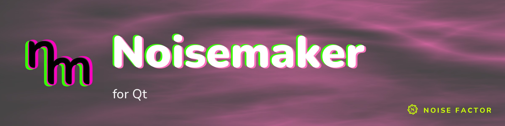

<!-- repo-hero -->
<a href="https://noisemaker.app/"></a>

<sub>Open source from <a href="https://noisefactor.io">Noise Factor</a> &middot; <a href="https://github.com/noisefactorllc">more projects</a></sub>

# Noisemaker for Qt

> This package supports the "Export Shader Pipeline" feature in Noisedeck.app. The feature runs shader compositions on other platforms. Noise Factor derives this package from the upstream Noisemaker Engine project and tests it for pixel-level parity.

**Noisemaker** is a procedural visual engine. Small text programs combine effects into chains, compile to a render graph, and run live as animated GPU textures. **Noisemaker for Qt** brings the same DSL compiler and effects library to Qt 6. It includes a C++17 library (`noisemaker-qt`, namespace `nm::`), an offscreen render CLI (`nm-render`), and a live `QOpenGLWidget` example. These use classic `QOpenGL*` with pixel-level parity against the reference engine.

## Family context

This port is one of several hand-ports of the same reference engine. Siblings target Unity (HLSL), Godot (GDShader), TouchDesigner (GLSL), and other platforms. They share the following infrastructure:

- The engine-agnostic `reference/01–10` re-implementer specs.
- The render-graph JSON contract (`docs/GRAPH-JSON-SCHEMA.md`).
- The parity-harness design (`parity/`).

Unlike the HLSL/GDShader ports, this port shares the reference's shader *language*. Desktop GLSL belongs to the same family as the reference's WebGL2 GLSL ES source. This port therefore commits byte-identical reference GLSL instead of deriving it again. See [ARCHITECTURE.md](ARCHITECTURE.md), "Shader corpus" and "Why classic OpenGL", for the effect on parity risk.

## What's here

- **`libnoisemaker-qt`** (CMake target `noisemaker-qt`) — the DSL compiler
  (`qt/noisemaker/compiler/`: lexer → parser → validator → expander → resources → orchestrator)
  and the render-graph runtime (`qt/noisemaker/runtime/`: a `QOpenGL*` executor, `nm::Backend`).
  Qt 6 Core/Gui/OpenGL only — no Widgets/QML dependency.
- **`nm-render`** (`qt/tools/nm-render/`) — an offscreen render CLI: `--dsl <file>` (live compiler)
  or `--graph <json>` (a pre-exported graph) in, a PNG out. Drives the parity harness and doubles
  as a standalone batch renderer.
- **`examples/viewer`** — a minimal live `QOpenGLWidget` embedding: DSL in (the live compiler path,
  `nm::compileGraph`), an animated render out, at roughly 60fps. This demonstrates how to embed the library in a Qt application. Widgets/OpenGLWidgets are a dependency of
  this example only, never of `libnoisemaker-qt` itself.

## Quickstart

Every command below was verified by literally running it before it was written down here.
The commands below use the core library's canonical build directory, `qt/build` (gitignored). Any out-of-tree build directory works the same way. T7's verification used identical commands with a scratch build directory: the same flags, but a different `-B`/`--prefix` path. See the task report for the literal transcript. The
`examples/viewer` commands further down were verified against these exact literal paths, no
substitution needed.

### Build the library, CLI, and tests

```sh
cmake -B qt/build -S qt -G Ninja -DCMAKE_PREFIX_PATH=/opt/homebrew/opt/qt
cmake --build qt/build
ctest --test-dir qt/build --output-on-failure
```

### Render a DSL program to a PNG

```sh
qt/build/nm-render --dsl parity/corpus/weird_mandala.dsl --size 512x512 --time 0.5 --frames 1 --out /tmp/out.png
```

### Build and run the live viewer example

With no installed `noisemaker-qt` package on `CMAKE_PREFIX_PATH`, this builds against the sibling
`qt/` tree directly (`add_subdirectory`):

```sh
cmake -B examples/viewer/build -S examples/viewer -G Ninja -DCMAKE_PREFIX_PATH=/opt/homebrew/opt/qt
cmake --build examples/viewer/build
examples/viewer/build/viewer              # opens a window with a live animated render
examples/viewer/build/viewer --selfcheck  # headless-friendly: renders ~3s, screenshots to
                                           # /tmp/viewer.png, asserts the result is non-flat and
                                           # that no GL error was observed, exits 0 (pass) / 1 (fail)
```

### Build the viewer against an *installed* package instead

`libnoisemaker-qt` supports `find_package`. Installation exports a static library, its public headers, and its runtime shader/effect data under one prefix. The runtime loads this data from disk. The data is never compiled into the library.

```sh
cmake --install qt/build --prefix /path/to/some/prefix
cmake -B examples/viewer/build2 -S examples/viewer -G Ninja \
  -DCMAKE_PREFIX_PATH="/opt/homebrew/opt/qt;/path/to/some/prefix"
cmake --build examples/viewer/build2
examples/viewer/build2/viewer --selfcheck
```

## Status, parity, and coverage

A from-scratch rebuild and full re-verification produced these results:

- **210 effect definitions.**
- **311/311 shaders byte-identical.**
- **6/6 compiler oracle gates at 345/345.**
- **Corpus-wide pixel sweep: 289 PASS / 45 NEAR / 1 CHAOS / 0 FAIL of 335.**

**[STATUS.md](STATUS.md)** is the single source of truth. It includes coverage by namespace, every NEAR mechanism with its evidence, and the CHAOS entry's isolation evidence. It also includes timed and live-DSL results and known limits. This README does not duplicate it further.

## Architecture

See **[ARCHITECTURE.md](ARCHITECTURE.md)** for the render-graph seam, OpenGL-vs-RHI decision record, shader corpus policy, runtime model, and compiler design. Follow **[PORTING-GUIDE.md](PORTING-GUIDE.md)** when changing this port. It covers the shader byte-copy policy, GL state parity rules, and compiler porting rules.

## License and trademark

Code is MIT-licensed. See [LICENSE](LICENSE). [TRADEMARK.md](TRADEMARK.md) governs use of the "Noisemaker" and "Noise Factor" names. Read it before using either name for a derivative product.
